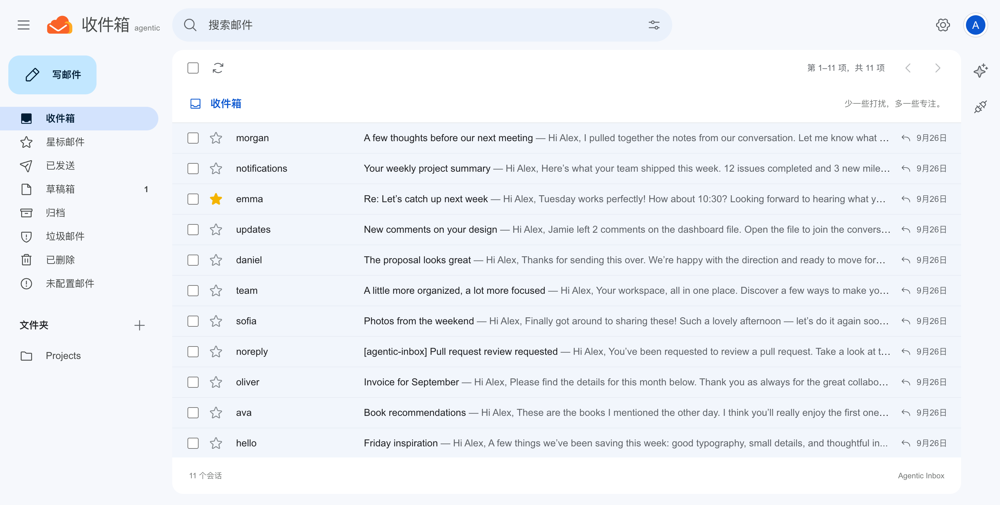
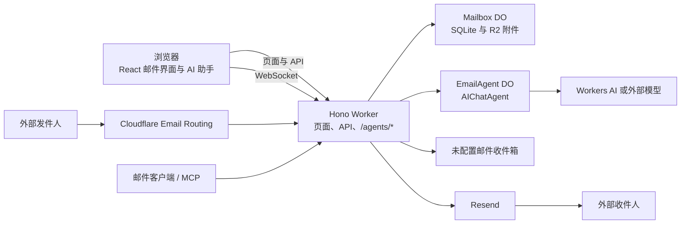

<div align="center">
  <h1>Agentic Inbox</h1>
  <p><em>运行在 Cloudflare Workers 上的自托管邮件客户端，内置 AI 邮件助手</em></p>
</div>

Agentic Inbox 是一款采用 Gmail 风格布局的邮件客户端，可以通过网页收发和管理邮件，并为每个邮箱提供 AI 助手。收件使用 [Cloudflare Email Routing](https://developers.cloudflare.com/email-routing/) 将邮件交给 Worker；配置完成的域名通过 Resend 发送邮件。每个邮箱由独立的 [Durable Object](https://developers.cloudflare.com/durable-objects/) 和 SQLite 数据库管理，附件保存在 [R2](https://developers.cloudflare.com/r2/)。



*界面采用 Gmail 风格；邮件由 Cloudflare Email Routing 收取，并通过 Resend 发出。*

项目介绍：[Email for Agents：使用 Cloudflare Email Service、Agents SDK、MCP 和 Wrangler CLI](https://blog.cloudflare.com/email-for-agents/)

## 功能

- **邮件收发与整理**：通过 Cloudflare Email Routing 收件、通过 Resend 发件；支持富文本写信、回复、转发、会话、附件、搜索、星标、归档、垃圾邮件、已删除邮件、自定义文件夹和草稿。
- **草稿保护**：自动保存到当前草稿；“保存并关闭”会将草稿留在草稿箱；切换邮箱前会先保存未完成的内容。
- **快捷键**：按 `C` 写邮件，按 `/` 或 `⌘/Ctrl + K` 搜索，按 `⌘/Ctrl + S` 保存草稿，按 `⌘/Ctrl + Enter` 发送。
- **多域名配置向导**：连接 Cloudflare 和 Resend，自动配置 Email Routing catch-all 收件规则、Resend 发信域名和 DNS 记录；可分别管理多个域名及其发信凭证。
- **未配置邮件**：投递到尚未创建邮箱的地址、且已由 Cloudflare 路由到 Worker 的邮件，会保存在“未配置邮件”页面中，可查看正文、下载附件或删除。
- **AI 邮件助手**：可读取邮件、搜索邮件和会话、生成新邮件或回复草稿。新邮件到达后会自动生成回复草稿；发送前仍需在界面中检查并确认。
- **可选 AI 服务商**：支持 Cloudflare Workers AI、OpenAI 兼容接口、Anthropic 和 Google Gemini。默认 Workers AI 模型为 `@cf/zai-org/glm-4.7-flash`；接入外部服务商需要自行提供 API Key。
- **中英文与主题**：支持简体中文、英文，以及浅色、深色和跟随系统外观设置。
- **PWA 安装**：可将应用安装到桌面或手机主屏幕；离线时显示重试页面，不会缓存邮件内容或登录凭证。
- **MCP 接口**：提供 `/mcp` 邮件工具，可供兼容 MCP 的 AI 客户端调用。

## 技术架构

- **前端**：React 19、React Router v7、Tailwind CSS、Zustand、TipTap、`@cloudflare/kumo`
- **后端**：Hono、Cloudflare Workers、Durable Objects（SQLite）、R2、Cloudflare Email Routing（收件）、Resend（发件）
- **AI**：[Cloudflare Agents SDK](https://developers.cloudflare.com/agents/)、[Workers AI](https://developers.cloudflare.com/workers-ai/)、AI SDK；可切换到 OpenAI 兼容服务、Anthropic 或 Gemini
- **认证**：部署环境使用 Cloudflare Access；本地开发跳过 Access 校验



## 开始使用

### 前置条件

- Cloudflare 账户，以及托管在 Cloudflare 上的邮件域名
- 已启用 Cloudflare Email Routing，用于收取邮件
- Resend 账户和 API Key；配置向导会添加并验证发信域名
- 部署或共享环境需要配置 Cloudflare Access
- 使用域名向导时，需要 Cloudflare API Token 和 Resend API Key

### 本地开发

```bash
npm install
cp .dev.vars.example .dev.vars
npm run dev
```

本地开发会跳过 Cloudflare Access 校验。需要添加域名或保存外部 AI 服务商的 API Key 时，请先在 `.dev.vars` 中配置 `AI_CONFIG_ENCRYPTION_KEY`。这个密钥必须是 Base64 编码的 32 字节密钥：

```bash
openssl rand -base64 32
```

将命令生成的值填入 `.dev.vars`。不要将 `.dev.vars` 或密钥提交到版本库。

### 部署到 Cloudflare

1. 登录 Wrangler，并根据自己的部署修改 `wrangler.jsonc` 中的 Worker 名称、R2 bucket 名称和 `DOMAINS` 环境变量。配置中的 `agentic-inbox` R2 bucket 需要预先创建；如果还没有，可以运行：

   ```bash
   npx wrangler r2 bucket create agentic-inbox
   ```

2. 部署应用。配置文件包含 Durable Objects、Workers AI、R2 和邮件发送 binding；通过域名向导配置的域名会使用 Resend 发信：

   ```bash
   npm run deploy
   ```

3. 在 Cloudflare 控制台为 Worker 启用 [Cloudflare Access](https://developers.cloudflare.com/cloudflare-one/policies/access/)。根据 Access 设置页面提供的值，为 Worker 配置 `POLICY_AUD` 和 `TEAM_DOMAIN` 两个 secret：

   ```bash
   npx wrangler secret put POLICY_AUD
   npx wrangler secret put TEAM_DOMAIN
   ```

   `TEAM_DOMAIN` 可以是 Access 团队域名，也可以是完整的 `.../cdn-cgi/access/certs` 地址。生产环境没有这两个值时，应用会拒绝请求。

4. 为 Worker 配置凭证加密密钥。域名向导和外部 AI 服务商的 API Key 都依赖这个密钥：

   ```bash
   openssl rand -base64 32
   npx wrangler secret put AI_CONFIG_ENCRYPTION_KEY
   ```

   将生成的密钥粘贴到 Wrangler 提示中。请妥善保存并保持该密钥稳定；更换密钥后，之前保存的加密凭证将无法读取，需要重新录入。此密钥只保存在 Worker secret 中，不要提交到代码库。

5. 打开已部署的应用，进入域名配置向导。验证 Cloudflare Token 和 Resend API Key 后，向导会启用 Email Routing、创建指向该 Worker 的 catch-all 收件规则、添加 Resend 发信域名并配置 DNS。只有邮件实际路由到这个 Worker 后，应用才能接收邮件；域名验证完成后，发件会通过 Resend 发送。

## 配置邮件域名

部署应用后，在首页或设置页打开“管理域名”，选择“添加域名”。向导需要：

- **Cloudflare API Token**：仅授权正在配置的域名，并授予 Zone Read、DNS Edit、Zone Settings Edit、Email Routing Rules Edit 权限。向导不会保存此 Token。
- **Resend API Key**：选择 Resend 的 Full Access 权限。密钥会使用 `AI_CONFIG_ENCRYPTION_KEY` 加密后保存。
- **域名**：该域名需要托管在 Cloudflare 上。

向导会启用 Email Routing、创建指向 Worker 的 catch-all 规则、在 Resend 中添加发信域名、写入 DNS 记录，并验证 SPF / DKIM。配置完成后，可创建多个邮箱地址。每个域名可以使用独立的 Cloudflare Token 和 Resend 账户；重新配置域名不会删除已有邮箱或邮件。

进入“未配置邮件”可以查看已经被路由到 Worker、但收件地址还没有在应用中创建邮箱的邮件。若 Cloudflare 中没有将邮件转发到 Worker，应用无法接收或显示这些邮件。

## 配置 AI 助手

在邮箱设置的“AI 连接”中选择服务商、模型，并填写服务商要求的 API Key。Workers AI 使用 Cloudflare binding，不需要填写 API Key；其他服务商需要提供 Base URL（如适用）和 API Key。API Key 在服务端加密，浏览器不会收到密钥明文。

AI 助手、自动草稿和内容检查会使用该邮箱选定的服务商和模型。使用外部服务商时，相关邮件内容会发送给该服务商处理。连接测试会发送固定测试提示，不会读取或发送真实邮件；测试和实际调用可能产生服务商费用。保存设置后才会应用到后续请求。

## 数据与访问边界

- 每个邮箱的数据保存在独立 Durable Object 的 SQLite 数据库中；邮件附件保存在 R2。
- 生产环境必须启用 Cloudflare Access，并配置 `POLICY_AUD` 与 `TEAM_DOMAIN`。
- 当前授权边界是同一套 Cloudflare Access policy：任何通过该策略的用户都可以访问应用中的所有邮箱。应用没有按邮箱单独授权。
- `/mcp` 使用相同的 Access 边界。连接到 MCP 的 AI 客户端可以通过 `mailboxId` 操作对应邮箱，因此只应授权可信用户和客户端访问。
- PWA 离线页面不会缓存邮件、凭证、API 响应或已认证页面，也不会离线排队发送邮件。

## PWA 安装

在配置页、首页、邮箱列表或邮箱设置中点击“安装应用”。符合安装条件时，Chrome 和 Edge 会显示原生安装提示。iPhone 或 iPad 用户可以在 Safari 中打开应用，选择“分享 → 添加到主屏幕”。正式部署需要 HTTPS；本地开发也可以使用 localhost 验证安装体验。

离线时应用只显示中英文重试页面；收发邮件、AI 功能和配置操作仍需要网络。Service Worker 更新后会提示刷新，刷新前请先保存未完成的邮件编辑。

## 开发命令

```bash
npm run dev          # 启动本地开发服务器
npm run typecheck    # 生成 Cloudflare 类型并运行 TypeScript 检查
npm run build        # 构建应用
npm run deploy       # 构建并部署 Worker
npm run test:ai      # AI 配置与模拟服务商测试
npm run test:domains # 域名配置与邮件路由测试
npm run test:pwa     # PWA 缓存与离线页面测试
```

这些自动化测试使用模拟服务，不会调用真实模型、修改外部 DNS 或发送真实邮件。

## 许可证

Apache 2.0，详见 [LICENSE](LICENSE)。
